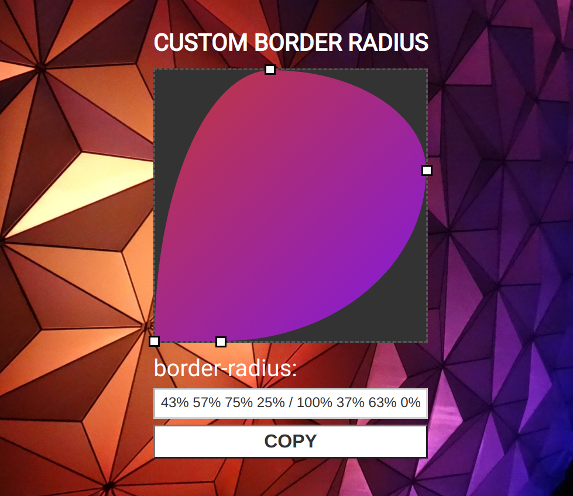

# Border Radius Previewer

## General Information:
This is a Vanilla JS tool to visualize the effect of adjusting the border-radius setting in CSS and copy the desired setting to the clipboard.

## Screenshot:

## Technologies:
- HTML
- CSS
- Vanilla Javascript

## Setup: 
The live version of the webpage can be seen [here](https://tpsst5.github.io/border-radius-previewer/).

## Status:
This project is complete.